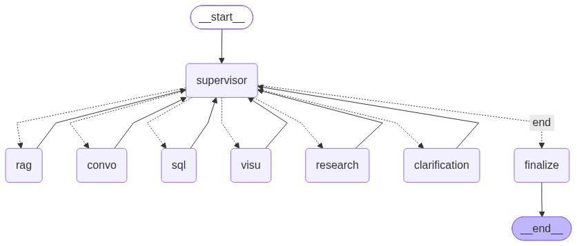
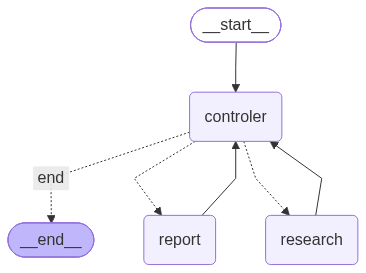

# SiliconCedars Agentic AI Onboarding Project

## Multi-Agent Supervisor

A hierarchical AI assistant built with LangGraph. A main supervisor routes requests to specialized agents for SQL, web research, RAG, visualization, and conversation.

Deterministic code guards, including attempt counters, task history, `done → end`, and same-turn SQL → visualization, handle loop prevention and routing invariants that proved unreliable when left purely to prompt instructions.

The LLM is only consulted for genuinely novel routing decisions.

## Architecture

The main graph is a supervisor loop: every specialist returns to the supervisor, which re-decides until it ends the turn through `finalize`.



The research route is a self-contained subgraph wrapped as a single node (`make_research_node`). It has its own controller and a report-writer terminal state.



## Structure

* `agents/`
  Main supervisor and specialized agents (SQL, visualization, conversation, RAG), plus the `research/` subgraph (sub-supervisor, researcher, report writer).

* `graph/`
  LangGraph orchestration. `workflow.py` builds the graph, while `routing.py` centralizes routing functions.

* `state/`
  Shared state definitions, including `SupervisorState`, `SubGraphSupervisorState`, `SpecialistResult`, `TaskRecord`, and related types.

* `tools/`
  Database access (`database.py`) and web search/fetch (`web_search.py`), including SSRF protections.

* `rag/`
  Indexing and retrieval over `lessons_learned`, backed by pgvector.

* `services/`

  * `llm.py`: Groq with OpenRouter fallback
  * `memory.py`: Checkpointer and long-term user memory
  * `errors.py`: Authentication vs. transient LLM error classification
  * `chart_storage.py`: Local storage client and authenticated chart serving
  * `logging_config.py`: LOG_LEVEL-driven logging setup

* `evaluation/`
  LangSmith evaluation for routing via `task_history`, RAG grounding, and correctness.

* `db/`
  Docker/Postgres initialization, including schema, roles, and pgvector.

* `tests/`
  Unit, specialist, LLM, and integration tests.

* `main.py`
  CLI entry point.

* `chat.py`
  Chainlit web chat entry point.

## Architecture Notes

### Security

Sensitive data such as salaries and credentials is protected by three layers, only one of which is a real security boundary:

| Layer | Mechanism | Role |
| --- | --- | --- |
| 1 | Tool binding by `permission_level` (`agents/sql_agent.py`) | A `general` user is never bound `get_salary` / `get_user_credential`, so the model cannot call them |
| 2 | PostgreSQL role grants (`db/init/02_roles.sql`) | **The actual security boundary.** `general_role` has no grants on `salaries` or `credentials`, and cannot even see them in `information_schema` |
| 3 | Sensitive-intent gate (`services/message_utils.py`) | UX fast-path only. A precision-first list of clear compensation/credential phrasings gives a clear denial instead of a database error; ambiguous terms (`earnings`, `bonus`, `credential`) are deliberately excluded to avoid false positives |

The keyword gate is deliberately **not** a security control: a missed synonym cannot grant access, because layer 2 still denies the query. An LLM-based classifier is intentionally not used for authorization, consistent with the project lesson that authorization must not be enforced by model judgment.

### Planning and Deterministic Execution

The supervisor's LLM decomposes the request into an ordered workflow **once per turn** (`WorkflowPlan`, e.g. `[sql, rag]` or `[sql, visu]`). Execution is then deterministic: each step runs, its result is written back into the plan, and the next pending step is forced. The final node combines every completed result into one answer.

* A single-intent request is a one-step plan.
* A chart over database data is `[sql, visu]`; the `visu` step renders from the SQL step's `structured_data` and needs no LLM.
* If a step fails, independent remaining steps still run. A later `visu` step that depends on database rows is marked `skipped` when those rows are unavailable, and the final answer says what was skipped.
* If planning fails, a single-decision fallback is used; if no provider is usable, the turn ends with a static message.

### Routing State Machine

The graph is `START → memory_manager → supervisor → {rag | convo | sql | visu | research | clarification} → supervisor → … → finalize → END`. Every specialist edge returns to `supervisor`; only `finalize` reaches `END`.

Each turn:

1. `memory_manager` resets the plan (`plan_ready=False`) and the per-turn counters.
2. On the first supervisor run, `get_workflow_plan` makes one LLM call and stores an ordered `plan: list[PlanItem]`.
3. On every run, the supervisor writes the previous specialist result into the first pending plan item (status, summary, issue, `structured_data`), records a `TaskRecord`, and sets `next` to the next pending step — deterministically, with no further routing LLM calls.
4. A completed SQL step with `structured_data` plus chart intent inserts a `visu` step; a `visu` step whose upstream SQL produced no rows is marked `skipped` instead of running.
5. When no pending steps remain, `next=end`; `finalize` combines all completed plan results (one LLM synthesis call when there is more than one) and reports skipped steps.

Clarification is an interrupt: the planner emits a single `clarification` step, `Clarification` pauses the graph, and on resume it clears `plan_ready` so the supervisor re-plans with the answer. `memory_manager` runs once per user turn, not on resume.

Failures are handled by the plan, not by per-hop routing: a failed step is marked `failed`, independent remaining steps still run, and a dependent chart step is `skipped` when no upstream rows exist. `finalize` maps internal issue codes to user-safe text and reports skipped steps. A per-turn hop cap (`MAX_HOPS`, `MAX_PLAN_STEPS + MAX_CLARIFICATIONS_PER_TURN + 1`) ends any turn that exceeds the legitimate step budget, logging an error because reaching it means a plan invariant broke.

The research subgraph (`agents/research/`) is its own controller loop. `sub_controller` ends immediately if `report_written` is set, forces `report` after `MAX_RESEARCH_ATTEMPTS`, and forces `report` once a substantial research note exists — so it cannot loop on the report step.

### Cost and Latency Budget

Beyond per-node caps, a single turn has an aggregate LLM budget enforced at the one place every call passes through (`ResilientLLM.invoke`):

* `MAX_LLM_CALLS_PER_TURN` (default 20) — counts every provider contact, including fallback attempts.
* `MAX_TOKENS_PER_TURN` (default 60000, best-effort from response usage metadata).
* `MAX_TURN_SECONDS` (default 120) — accumulated **LLM call time**, not wall-clock. Human think-time (e.g. answering a clarification) and tool/DB latency do not count.

When the budget is exhausted, `TurnBudgetExceeded` is raised, specialists degrade to a `failed` result, and the supervisor forces `end` so the turn closes gracefully instead of multiplying calls. The one exception is chart rendering from existing `structured_data`, which is deterministic and needs no LLM, so it is still allowed.

Budget scope differs by entry point:

* **CLI (`main.py`)**: one budget spans the logical turn, including the clarification interrupt/resume loop.
* **Chainlit (`chat.py`)**: a clarification resume arrives as a new `on_message`, so the budget is effectively **per inbound message**, not per logical turn.

Callers that invoke the graph directly (evaluation, unit tests) run without a budget.

### Long-Term Memory

Long-term memory is keyed by `user_id` and stores flat key-value facts in PostgreSQL.

A keyword heuristic gates whether an extraction LLM call is made.

### Short-Term Memory

`memory_manager` runs once per turn.

It:

* Summarizes old messages after they pass a length threshold.
* Prunes old `task_history`.
* Keeps the current-turn history available because routing guards only read the current turn.

## Setup

### 1. Environment Variables

Copy `.env.example` to `.env` and fill in:

```env
GROQ_API_KEY=              # required
LANGSMITH_API_KEY=         # optional, tracing and evaluation
OPENROUTER_API_KEY=        # optional; only for explicit openrouter/... models
DATABASE_URL=              # required if CHECKPOINT_BACKEND=postgres
CHAINLIT_DATABASE_URL=     # required for `chainlit run chat.py`

DB_HOST=localhost
DB_PORT=5432
DB_NAME=company_intel
DB_GENERAL_USER=general_role
DB_GENERAL_PASSWORD=general_dev_password
DB_ELEVATED_USER=app_owner
DB_ELEVATED_PASSWORD=devpassword
```

Optional variables with defaults:

```env
DEFAULT_USER_ID=test-user-1
DEFAULT_THREAD_ID=thread-test-user-1
DEFAULT_PERMISSION_LEVEL=general    # "general" or "elevated"
CHECKPOINT_BACKEND=memory            # "memory" or "postgres"
LOG_LEVEL=INFO                       # DEBUG, INFO, WARNING, ERROR
DB_POOL_MIN_SIZE=1
DB_POOL_MAX_SIZE_GENERAL=5
DB_POOL_MAX_SIZE_ELEVATED=3
DB_POOL_ACQUIRE_TIMEOUT=30
DB_CONNECT_TIMEOUT=5
CHART_STORAGE_DIR=.chainlit_charts
RAG_NO_MATCH_DISTANCE_THRESHOLD=0.8  # max pgvector distance to count as a match
MAX_LLM_CALLS_PER_TURN=20            # aggregate per user turn
MAX_TOKENS_PER_TURN=60000            # best-effort; structured outputs may not report usage
MAX_TURN_SECONDS=120                 # accumulated LLM call time per user turn
```

Use `general` unless you are explicitly testing salary or credential paths.

### 2. Database

Start PostgreSQL with:

```bash
docker compose up -d
```

This starts Postgres with pgvector and runs `db/init/` on first startup. Initialization includes the schema, seed data, roles, and `general_embeddings`.

If you change the Docker image or initialization scripts after the volume already exists:

```bash
docker compose down -v
docker compose up -d
```

Check the installed extensions:

```bash
docker exec -it silicon_cedars_db psql -U app_owner -d company_intel -c "\dx"
```

Check the tables:

```bash
docker exec -it silicon_cedars_db psql -U app_owner -d company_intel -c "\dt"
```

Expected tables include:

* `employees`
* `sales`
* `salaries`
* `credentials`
* `lessons_learned`
* `general_embeddings`

The `vector` extension should also be installed.

### Demo Logins

`db/init/05_app_users.sql` seeds three local-only accounts for the Chainlit login
(`alice/alice123` and `admin/admin` are `elevated`; `bob/bob123` is `general`).
Passwords are plain for local demo only; regenerate the bcrypt hashes before any
real deployment.

### 3. Python Dependencies

Create and activate the virtual environment:

```bash
python -m venv .venv

# Windows
.venv\Scripts\activate

# Unix
source .venv/bin/activate
```

Install dependencies:

```bash
pip install -r requirements.txt
```

This is a frozen environment snapshot. `pywin32` is skipped on non-Windows systems.

### 4. Index the RAG Corpus

Run this once, and again whenever `lessons_learned` changes:

```bash
python -m rag.indexing
```

## Running

### CLI

```bash
python main.py
```

Type `quit` or `exit` to leave.

### Web

```bash
chainlit run chat.py
```

This requires `CHAINLIT_DATABASE_URL`.

## Testing

Run the unit tests:

```bash
pytest
```

Run live LLM tests:

```bash
pytest -m llm
```

Run integration tests:

```bash
pytest -m integration
```

### Prerequisites

`pytest.ini` sets a default filter (`-m "not llm and not integration"`), so a plain `pytest` run never calls the LLM or touches the database.

* **LLM tests** (`llm`): require `GROQ_API_KEY` or `OPENROUTER_API_KEY`.
* **Integration tests** (`integration`): require a running Postgres (`docker compose up -d`) and the `DB_*` / `DATABASE_URL` environment variables.
* **Postgres checkpointer tests**: additionally require `DATABASE_URL` and `CHECKPOINT_BACKEND=postgres`.

### Test Commands

| Command | What it runs |
| --- | --- |
| `pytest` | Unit tests only (default; excludes `llm` and `integration`) |
| `pytest -m "not llm and not integration"` | Same as `pytest`, written explicitly |
| `pytest -m llm` | Live LLM tests (`test_llm_*.py`, RAG grounding, SQL permission gating) |
| `pytest -m integration` | Tests requiring live services (DB roles, checkpointer, pools, chart route) |
| `pytest -m "llm or integration"` | All live tests |
| `pytest -m "not llm"` | Unit + integration |
| `pytest -m "not integration"` | Unit + LLM |
| `pytest tests/test_routing.py` | A single test file |
| `pytest tests/test_routing.py::test_name` | A single test |
| `pytest -k "sql"` | Tests whose name matches a keyword |
| `pytest tests/test_security_boundaries.py tests/test_sql_roles.py` | Security keyword boundaries + DB role boundaries |
| `pytest --markers` | List registered markers |
| `pytest --collect-only -q` | List tests without running them |
| `pytest -v` | Verbose per-test output |
| `pytest -x` | Stop on the first failure |

To exclude a marker, quote the expression: `pytest -m "not llm"`. The form `pytest -m -llm` is not valid.

### Test Categories

* **Unit**
  Routing, `map_to_state`, research controller, supervisor rules, error classification, and graph compilation.

* **Specialist / LLM**
  `test_llm_*.py`, SQL permission gating, and RAG grounding.

* **Security**
  `test_security_boundaries.py` (keyword boundaries), `test_prompt_injection.py` (adversarial content at the `current_task`, RAG, web, and tool-result boundaries), and `test_sql_roles.py`. The database role is the actual enforcement point; the injection suite is deterministic and needs no live services.

* **Budgets**
  `test_budget.py` covers the per-turn call/token/wall-clock caps and graceful degradation, using a fake LLM and no network.

## Evaluation

Evaluation requires `LANGSMITH_API_KEY`.

Dataset names are created once. Bump the name, for example `routing-eval-v2`, if the examples change.

```python
from graph.workflow import main_workflow
from services.memory import get_checkpointer
from evaluation.evaluation import (
    run_routing_evaluation,
    run_rag_evaluation,
)

memory, _ = get_checkpointer()
graph = main_workflow(memory)

run_routing_evaluation("routing-eval-v1", graph)
run_rag_evaluation("rag-eval-v1")
```

### Routing Evaluation

Routing evaluation reads the turn's `plan` (completed steps), falling back to `task_history`, to determine which specialists ran.

Clarification is scored through the graph interrupt.

Chart requests appear as SQL followed by visualization in the same plan.

### RAG Evaluation

RAG evaluation checks structural status and issue information for out-of-corpus honesty.

LLM-as-judge correctness is used only when a reference answer exists.

## Known Limitations

* **CLI has no real authentication**
  The `main.py` CLI reads `user_id` and `permission_level` from its configuration rather than a verified identity. The Chainlit entry point (`chat.py`) authenticates against `app_users` with bcrypt and derives `permission_level` from the logged-in user.

* **Charts in the web UI**
  The Chainlit entry point renders the generated PNG inline (`cl.Image`). Element
  files are persisted by a local storage client and served through an
  authenticated `/charts/<token>` route, so charts survive a page refresh. The
  `main.py` CLI prints the file path instead of rendering the image.

* **Charts need exactly two columns**
  A result is chartable only when every row is a `label`/`value` pair (a string
  label and a numeric, non-boolean value), for example
  `SELECT region, SUM(amount) FROM sales GROUP BY region`. A single count or a
  3-column result is not chartable; the chart step is skipped and the answer says
  so instead of inventing values.

* **No cross-turn data chaining**
  Requests such as `"chart that"` after a previous `Finalize` are not supported. Same-turn SQL → visualization is supported.

